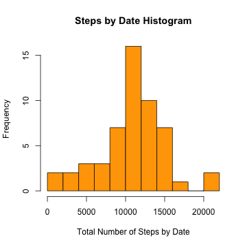
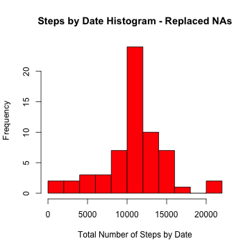

Analysis of Fitness Tracker Data
================================

Loading and preprocessing the data
----------------------------------

Load required packages and read in the data from the activity.csv file.


```r
library(lattice)
library(plyr)

unzip("activity.zip")
activity <- read.csv("activity.csv")
```

Add the total number of steps for each day and filter out NAs. Save steps column as stepsByDate.


```r
stepsByDate <- aggregate(.~date, data=activity, sum, na.rm=TRUE)
stepsByDate <- stepsByDate[,2]
```

Mean total number of steps taken per day
----------------------------------------

Draw the histogram of the steps by date.


```r
hist(stepsByDate, breaks=10,main="Steps by Date Histogram",
     xlab="Total Number of Steps by Date",ylab="Frequency",col='orange')
```

 

Calculate the mean and median of the daily steps values.


```r
meanSteps = mean(stepsByDate)
medianSteps = median(stepsByDate)
```

Results:

* **Mean** of steps: 10766.19

* **Median** of steps: 10765.

Average daily activity pattern
-------------------------------------------

Get the average number of steps for each time interval and remove NAs.  Plot the time series with average number of step for each time interval accross all days.


```r
intervalSteps = activity[,c('steps', 'interval')]
avgByInterval <- aggregate(.~interval, data=intervalSteps, mean, na.rm=TRUE)
plot(steps ~ interval, data=avgByInterval, type='l',
     main="Average # of Steps Across All Days by Interval",
     xlab="Intervals", ylab="Average # of Steps")
```

 

<sup>Note - Intervals written as HHMM where first two digits represent hours and second two represent minutes.</sup>

Determine at which time interval the most steps are recorded.  Find the maximum average steps for each interval, get the index of that value in the avgByInterval data frame, and save the interval value at that index.


```r
maxIndex = which.max(avgByInterval$steps)
maxRow = avgByInterval[maxIndex,]
maxAvgSteps = maxRow$steps
maxInterval = maxRow$interval
```

On average the interval in which the most steps (206.1698) are recorded at interval **835**.

Imputing missing values
-----------------------

Determine how many missing values are in the dataset by finding NAs.


```r
missing_data <- activity[!complete.cases(activity),]
missing_rows <- nrow(missing_data)
total_rows <- nrow(activity)
```

There are **2304** instances of missing data out of 17568 instances. 

#### Filling in the missing NA values

To address all the missing data we can substitute NA steps values with the average number of steps for each interval.  The assumption is that for each interval on any given day the average steps for that interval across all days will be a reasonable substitute for an NA.


```r
intervalMerge <- merge(activity, avgByInterval, by="interval", suffixes=c(".orig", ".avg"))
intervalMerge$steps <- ifelse(is.na(intervalMerge$steps.orig), intervalMerge$steps.avg,
                              intervalMerge$steps.orig)
filledData <- intervalMerge[,c('steps', 'date', 'interval')]
head(filledData)
```

```
##   steps       date interval
## 1 1.717 2012-10-01        0
## 2 0.000 2012-11-23        0
## 3 0.000 2012-10-28        0
## 4 0.000 2012-11-06        0
## 5 0.000 2012-11-24        0
## 6 0.000 2012-11-15        0
```

Used the filled in data to make new calculations on the sum of steps by date.


```r
stepsByDate <- aggregate(.~date, data=filledData, sum, na.rm=TRUE)
stepsByDate <- stepsByDate[,2]
```

Draw the histogram of the steps by date for the filled in data.


```r
hist(stepsByDate, breaks=10,main="Steps by Date Histogram - Replaced NAs",
     xlab="Total Number of Steps by Date",ylab="Frequency",col='red')
```

 

Calculate the new mean and median of the daily steps values.


```r
meanStepsFilled = mean(stepsByDate)
medianStepsFilled = median(stepsByDate)
```

Results:

* **Mean** of steps: 10766.19

* **Median** of steps: 10766.19.

#### Evaluation of change from replacing NAs

The difference in mean steps before and after filling in the NAs.

```r
abs(meanStepsFilled - meanSteps) 
```

```
## [1] 0
```

The difference in median steps before and after filling in the NAs.


```r
abs(medianStepsFilled - medianSteps) 
```

```
## [1] 1.189
```

The mean did not change, which makes sense since the missing values were replaced with the mean values. The median increased slightly due, which also makes sense since more non-zero values were added in a dataset with a lot of zeros.  Overall though the effect was very small.

Differences in activity patterns between weekdays and weekends
--------------------------------------------------------------

Add a new columns day using the weekdays function to convert dates to day names.  Add another column which has the dayType "weekend" or "weekday" based on whether the day is either Saturday or Sunday. Apply the mean function to the steps on weekends and weekdays.


```r
filledData$day<- weekdays(as.Date(filledData$date))
filledData$dayType <- ifelse(filledData$day %in% c("Saturday", "Sunday"),
                             "weekend", "weekday")
filledDataAvgs <- ddply(filledData, .(interval, dayType), summarise, steps = mean(steps))
```

Plot the mean steps by interval for the weekends and the weekdays separately.


```r
xyplot(steps ~ interval | dayType, data = filledDataAvgs, layout = c(1, 2), type = "l")
```

 

#### Weekend vs Weekday Analysis

It may be observed from the comparison of the weekend and weekday graphs that the activity is higher early in the day on weekdays but less sustained throughout the day.  It is likely that subject does exercise before work on weekdays to account for the spike before 9AM, but is more sedentary throughout the day.
